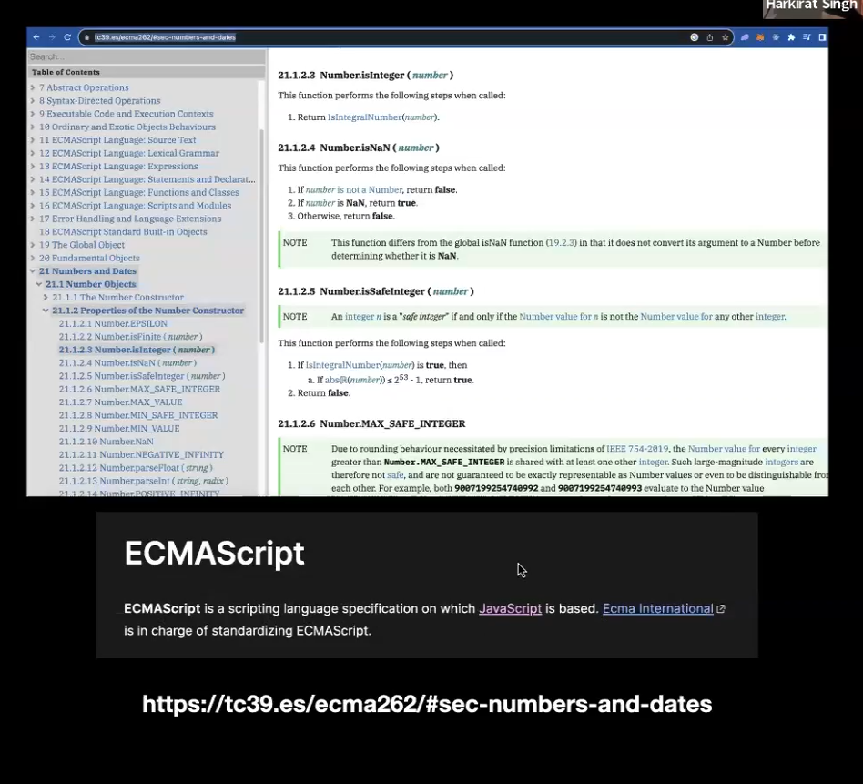
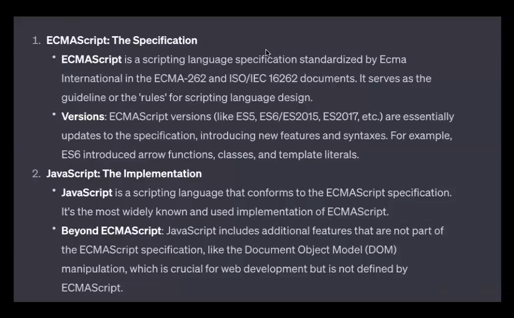
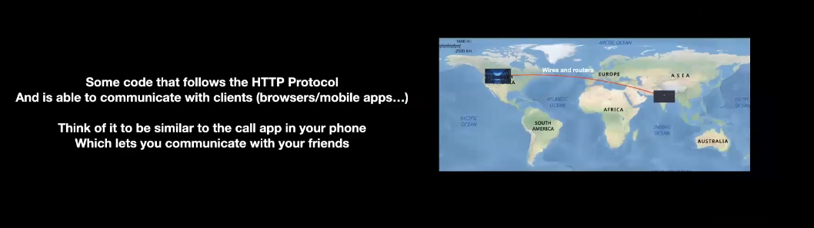
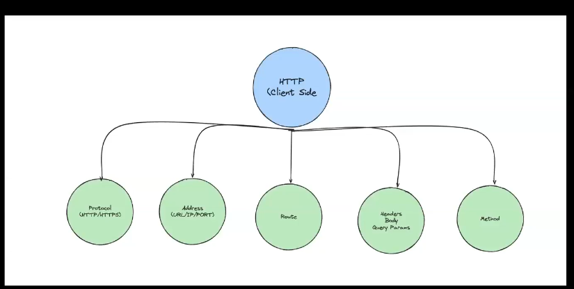
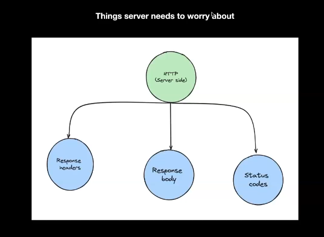

What is ECMAScript?

This is a scripting languuage specification in which javaScript is based

common js browser engines 

1. V8 - google chrome,chromium - C
2. SpiderMonkey - used by Mozilla - C+Rust

JavaScript is a language and NodeJS is runtime
Bun is also a language used for backend programming and it is significantly faster than NodeJS in execution and its written in Zig.

What can we do with JS?
1)Create CLIs (command line interface)
2)Create a video Player
3)Create a game
4)Create an HTTP server (biggest usecase)

What is an HTTP Server?

HTTP stands for HyperText Transfer Protocol : A protocol that is defined for machines to communicate

Specifically for websites, it is the most common way for your machines to talk to its backend. 

In the end , it is the client throwing some information at the server .... Server doing something with that information and responding back with the final result.

Client Side of HTTP Protocol:

Server Side of HTTP Protocol:

