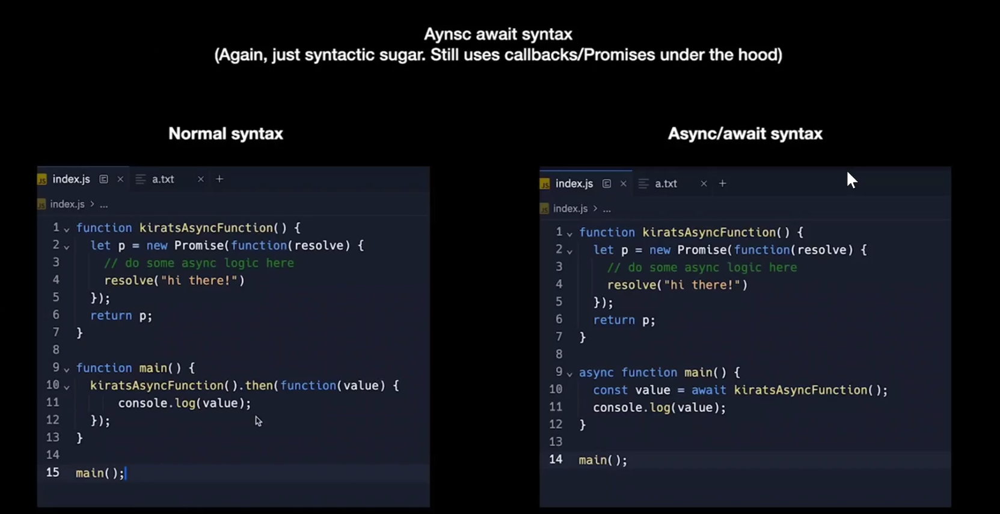
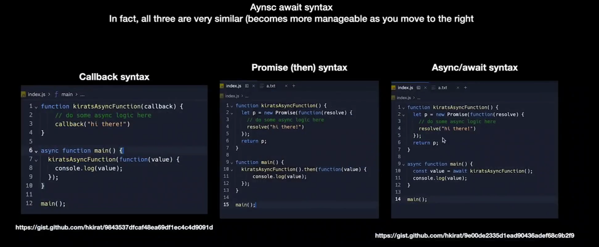

"Async fn VS Sync fn"

sync -- together ,  one after another , only one thing is happening at a time</br>
async -- opposite of sync, happens in parts , multiple things are context switching with each other

```Javascript
function findSum(n) {
    let ans = 0;
    for(let i = 0;i<n;i++){
        ans += i;
    }
    return ans;
}

function findSumTill1000(){
    return findSum(100);
}

setTimeout(findSumTill1000,1000)    //calling as async function
console.log("hello world")
```

Another async function 

```Javascript
const fs = require('fs');
fs.readFile("a.txt","utf-8",function(err,data){
    console.log(data);
});
console.log("this is a message");
```

Real use of callback functions are in the case of async functions


Promises in JavaScript :

It is just a class that make callbacks and async funtions more readable.
Promises are syntactical sugar that makes the code slightly more readable

Example : 

```JavaScript

function ReadFile() {
  return new Promise(function (resolve) {
    fs.readFile("a.txt", "utf-8", function (err, data) {
      resolve(data);
    });
  });
}

function onDone(data) {
  console.log(data);
}

ReadFile().then(onDone);
```

Async Await


Difference between normal syntax and async await syntax


This is usually used on the caller side , not on the side where you define the async function
Any function which wants to use await , must be a async function 

